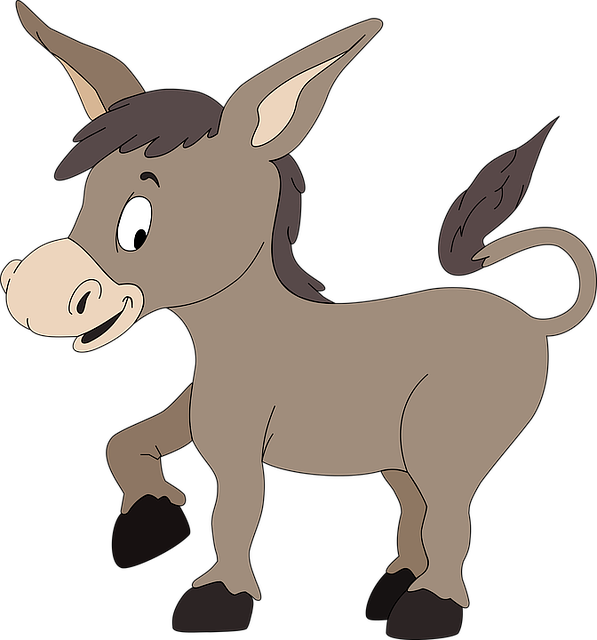
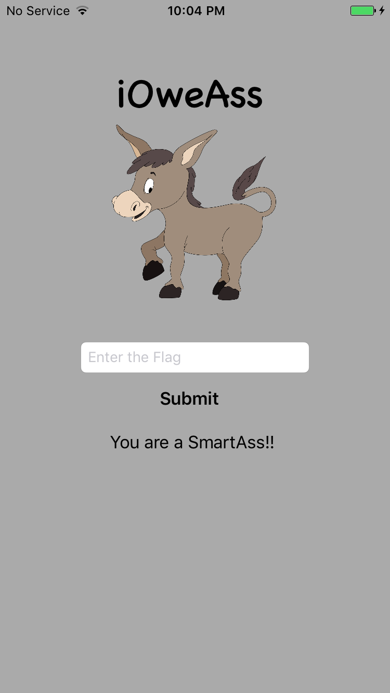

# iOweAss - iOS Crackme

Are you a SmartAss or JackAss!! 

    

## Objective

iOweAss is an iOS crackme. Goal is to find a secret string to unlock the application. There are layers of defenses implemented in the application to challenge your skills. On successfully guessing the secret string you will be greeted with **"You are a SmartAss!!"** message. 

    

## Installation

Currently the application is unsigned and you need to sign it before installing on an iDevice. If you have developer profile, you can sign the app using [iOS App Signer](https://dantheman827.github.io/ios-app-signer/) or run it on a jailbroken device. You will need to do one of them anyways.  

Open an issue if you face any problem in running the application.  

Logo from: https://pixabay.com/vectors/burro-donkey-jackass-1295711/
